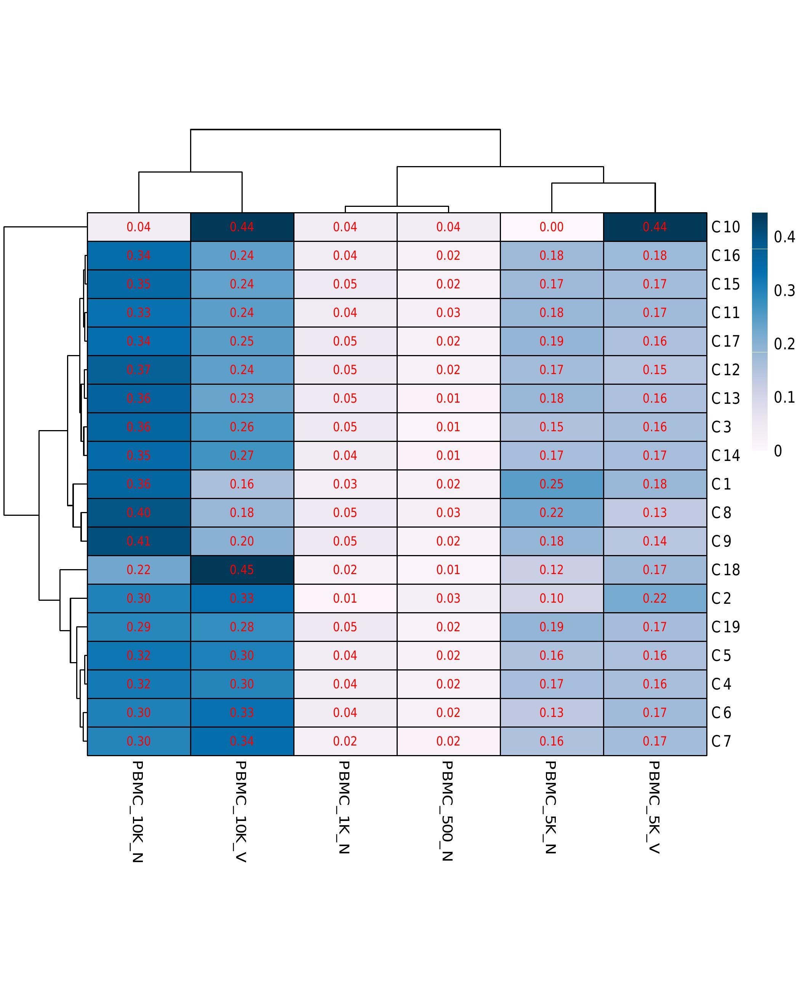
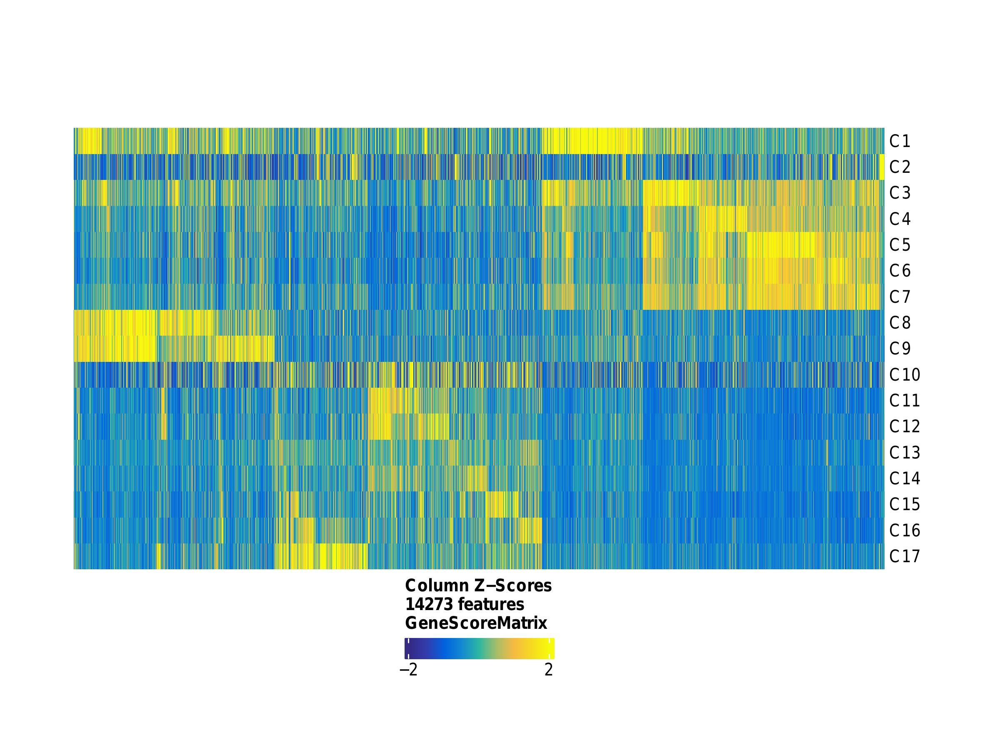

# 

## Table of Contents
[Introduction](#introduction)  
[Pipeline summary](#pipeline-summary)
- [PREPROCESS_DEFAULT](#preprocess_default)
- [PREPROCESS_10XGENOMICS](#preprocess_10xgenomics)
- [PREPROCESS_CHROMAP](#preprocess_chromap)
- [DOWNSTREAM_ARCHR](#downstream_archr)

[Quick Start](#quick-start)  
[Example: plots in paper](#example-plots-in-paper)  
[Documentation](#documentation)  
[Credits](#credits)  
[Bug report/Support](#bug-reportsupport)  
[Citations](#citations)

## Introduction

**scATACpipe** is a bioinformatic pipeline for single-cell ATAC-seq (scATAC-seq) data analysis.

The pipeline is built using [Nextflow](https://www.nextflow.io), a workflow tool to run tasks across multiple compute infrastructures in a very portable manner. It uses Docker / Singularity containers making installation trivial and results highly reproducible.

The development of the pipeline is guided by  [nf-core TEMPLATE](https://github.com/nf-core/tools/tree/master/nf_core/pipeline-template).

## Pipeline Summary

The pipeline consists of 2 relevant parts: preprocessing (from fastq to fragment file) and downstream analysis. If fragment files are directly available, you can choose to skip preprocessing and run downstream analysis only.

For preprocessing, 3 alternative strategies are available that are implemented in 3 sub-workflows respectively, namely, **PREPROCESS_DEFAULT**, **PREPROCESS_10XGENOMICS**, and **PREPROCESS_CHROMAP**. Each of them supports various input types that are demonstrated in further detail below (also see [usage](https://github.com/hukai916/scATACpipe/blob/main/docs/usage.md)).

For downstream analysis, we implemented **DOWNSTREAM_ARCHR** sub-workflow that integrates ArchR and other tools (e.g. AMULET for doublet detection).

Below is a simplified diagram to illustrate the design logic and functionalities of scATACpipe.
<p align="center">
  
</p>
The main functionalities of each sub-workflow are summarized below. You can also refer to the [output - Result folders](https://github.com/hukai916/scATACpipe/blob/main/docs/output.md#result-folders) for more details.

#### PREPROCESS_DEFAULT:
1. Add barcodes to reads
2. Correct barcodes (optional)
    * if `false`: skip barcode correction
    * if `pheniqs` or `naive`: also filter out non-cells using "inflection point" method
3. Trim off adapters
4. Mapping
    * download genome/annotation or use custom genome
    * build genome index if not supplied
5. Filter BAM
6. Remove PCR duplicates
7. Quality control
8. Generate fragment file, *etc.*

#### PREPROCESS_10XGENOMICS:
1. Build 10XGENOMICS index if not supplied
    * download genome/annotation or use custom genome
2. Execute `cellranger_atac count` command
3. Extract fragments from valid cells according to `filtered_peak_bc_matrix/barcodes.tsv`

#### PREPROCESS_CHROMAP:
1. Build Chromap index if not supplied
    * download genome/annotation or use custom genome
2. Execute `chromap --preset atac` command
3. Filter out non-cells

Note that no BAM file will be generated for PREPROCESS_CHROMAP option.

#### DOWNSTREAM_ARCHR:
1. Build ArchR-compatible genome/annotation files if not natively supported (ArchR supports hg19, hg38, mm9, and mm10 as of 02/2022)
    * download genome/annotation if not supplied
    * build ArchR genome/gene annotation files if needed
2. Perform downstream analysis with ArchR and generate various analytical plots
    * filter doublets (with ArchR built-in method or AMULET)
    * dimension reduction
    * batch effect correction
    * clustering
    * embedding
    * pseudo-bulk clustering
    * scRNAseq integration if supplied
    * marker gene detection
    * call peaks
    * marker peak detection
    * pairwise testing
    * motif enrichment
    * footprinting
    * coaccessibility, *etc.*

The pipeline also splits BED and/or BAM files according to ArchR clusterings and summarizes all results into a single MultiQC report for easy view.

## Quick Start

1. Install [`nextflow`](https://nf-co.re/usage/installation)(>=21.10.0).

2. For full reproducibility, install either [`Docker`](https://docs.docker.com/engine/installation/) or [`Singularity (Apptainer)`](https://www.sylabs.io/guides/3.0/user-guide/) and specify `-profile singularity` or `-profile docker` accordingly when running the pipeline so that all dependencies are satisfied. Otherwise, all of the dependencies must be available locally on your PATH, **which is likely not true!**

3. Download the pipeline:
```bash
git clone https://github.com/hukai916/scATACpipe.git
```

4. Download a minimal test dataset:
    * The **test_data1** is prepared by downsampling (5% and 10%) a dataset named "*500 Peripheral blood mononuclear cells (PBMCs) from a healthy donor (Next GEM v1.1)*" provided by [10xgenomics](https://www.10xgenomics.com/resources/datasets?query=&page=1&configure%5Bfacets%5D%5B0%5D=chemistryVersionAndThroughput&configure%5Bfacets%5D%5B1%5D=pipeline.version&configure%5BhitsPerPage%5D=500&menu%5Bproducts.name%5D=Single%20Cell%20ATAC). Note that, in test_data1, I1 refers to index1, which is for sample demultiplexing and not relevant in our case; R1 refers to Read1; **R2 refers to index2**, which represents the cell barcode fastq; R3 refers to Read2.

  ```bash
  cd scATACpipe
  wget https://www.dropbox.com/s/uyiq18zk7dts9fx/test_data1.zip
  unzip test_data1.zip
  ```


5. Edit the `replace_with_full_path` in the assets/sample_sheet_test_data1.csv to use the actual **full path**.

6. Test the pipeline with this minimal test_data1:
    * At least 8GB memory is recommended for test_data1.
    * By default, the local executor will be used (`-profile local`) meaning that all jobs will be executed on your local computer.  Nextflow supports many other [executors](https://www.nextflow.io/docs/latest/executor.html) including SLURM, LSF, *etc.*. You can create a [profile](https://www.nextflow.io/docs/latest/config.html?highlight=profile#config-profiles) file to config which executor to use. Multiple profiles can be supplied with comma, e.g. `-profile docker,lsf`.
    * Please check [nf-core/configs](https://github.com/nf-core/configs#documentation) to see what other custom config files can be supplied.

  * **Example run with Docker using local executor:**
  ```bash
  nextflow run main.nf -profile docker --preprocess default --outdir res_test_data1 --input_fastq assets/sample_sheet_test_data1.csv --ref_fasta_ensembl homo_sapiens --species_latin_name 'homo sapiens'
  ```
    By executing the above command:
      - The `local executor` will be used.
      - `PREPROCESS_DEFAULT` will be used.
      - Output will be saved into `res_test_data1`.
      - Ensembl genome `homo_sapiens` will be downloaded and used as reference.

 * **Example run with Singularity using LSF executor:**
  ```bash
  nextflow run main.nf -profile singularity,lsf --preprocess default --outdir res_test_data1 --input_fastq assets/sample_sheet_test_data1.csv --ref_fasta_ensembl homo_sapiens --species_latin_name 'homo sapiens'
  ```
      - By specifying `-profile lsf`, the `lsf` executor will be used for job submission.
      - By specifying `-profile singularity`, Singularity images will be downloaded and saved to `work/singularity` directory. It is recommended to config the [`NXF_SINGULARITY_CACHEDIR` or `singularity.cacheDir`](https://www.nextflow.io/docs/latest/singularity.html?#singularity-docker-hub) settings to store the images in a central location.

7. Run your own analysis:
  * A typical command:
```bash
nextflow run main.nf -profile <singularity/docker/lsf> --preprocess <default/10xgenomics/chromap> --outdir <path_to_result_dir> --input_fastq <path_to_samplesheet> --ref_fasta_ensembl <ENSEMBL_genome_name> --species_latin_name <e.g. 'homo sapiens'>
```
  * For help:
```bash
nextflow run main.nf --help
```

See documentation [usage](https://github.com/hukai916/scATACpipe/blob/main/docs/usage.md) for all of the available options.

## Example: plots in paper

This section describes how the plots in the manuscript (to be added) were generated using scATACpipe. For comparison, the manuscript conducted 3 separate analyses, each using a different preprocessing strategy (`default`, `10xgenomics`, `chromap`). Since the commands and preprocessed results are quite similar across the three methods, only the `chromap` option will be demonstrated here.

1.  The initial execution:

```
nextflow run main.nf -profile singularity,lsf -c conf/test_chromap.config --preprocess chromap --outdir ./chromap_results_haibo --input_fastq /home/hl84w/lucio_castilla/scATAC-seq/docs/10X_human_scatac_fastq_new_style.csv --ref_fasta_ensembl homo_sapiens --species_latin_name 'homo sapiens' --archr_blacklist /home/hl84w/lucio_castilla/scATAC-seq/docs/hg38-blacklist.v2.bed.gz --doublet_removal_algorithm archr --archr_thread 8 -resume e209b4a2-1ada-4893-af13-132d1e3f5a55
```

```
nextflow run main.nf -profile singularity,lsf --preprocess chromap --outdir ./results_chromap --input_fastq ./assets/10X_human_scatac_fastq.csv --ref_fasta_ensembl homo_sapiens --species_latin_name 'homo sapiens' --archr_scrnaseq '/path/scRNA-Hematopoiesis-Granja-2019.rds' --archr_blacklist /home/hl84w/lucio_castilla/scATAC-seq/docs/hg38-blacklist.v2.bed.gz
```

Break down:

  * `-profile singularity,lsf`:

  This option instructs scATACpipe to use Singularity containers and LSF as the executor. Multiple parameters are separated by commas. Since `profile` is pipeline-level flag, it is prefixed with a single dash (`-`). Module-level flags are prefixed with double dash (`--`).

  * `--preprocess chromap`:

  This instructs scATACpipe to use Chromap preprocessing strategy.

  * `--outdir ./results_chromap`:

  Output will be saved into `./results_chromap` folder.

  * `--input_fastq ./assets/10X_human_scatac_fastq.csv`:

  Please replace the `/path/` in the `10X_human_scatac_fastq.csv` with absolute paths. Details regarding the 6 samples can be found in the supplementary section of the paper. If you detect any outlier samples, you can remove them from the downstream analyses using the `--filter_sample = 'PBMC_10K_C, PBMC_10K_X'` flag.

  * `--ref_fasta_ensembl homo_sapiens`:

  This specifies that the genome _Homo Sapiens_ from ENSEMBLE will be used as reference. To view all supported genomes, check out `nextflow run main.nf --support_genome`.

  * `--species_latin_name 'homo sapiens'`:

  Simply the Latin name of the reference genome.

  * `--archr_scrnaseq '/path/scRNA-Hematopoiesis-Granja-2019.rds'`

  Matching scRNA-seq data. Can ignore if not available. The example file can be downloaded [here](https://jeffgranja.s3.amazonaws.com/ArchR/TestData/scRNA-Hematopoiesis-Granja-2019.rds).

  * `--archr_blacklist ./assets/hg38-blacklist.v2.bed.gz`:

  Blacklist to exclude for downstream analysis. Click [here](https://github.com/Boyle-Lab/Blacklist/tree/master/lists) for other species.

Instead of passing each flag option via the command line, you can include them all in a configuration file and supply it with the `-c` option. Below is equivalent to above:
```
nextflow run main.nf -profile singularity,lsf -c ./conf/test_chromap_initial.config
```

What are inside **test_chromap_initial.config**:
https://github.com/hukai916/scATACpipe/blob/216f1460577926a04a2d2918f36588afb6217f8a/conf/test_chromap_initial.config#L1-L10

Again, you have to replace `/path/` with full absolute paths.

2.  The final execution:

After examining the results from the initial execution, we decided to remove the
outlier clusters (C2, C10) from downstream analyses. These two clusters are considered problematic according to the following two plots:
  * The clustering heatmap plot from **./results_chromap/archr_clustering/** folder: the cell proportions from `PBMC_5K_N` and `PBMC_5K_V` samples are unbalanced for C2, C10.
<p align="center">
  
</p>

  * The marker gene heatmap plot from **./results_chromap/archr_marker_gene_clusters/** folder: no distinct marker gene pattern detected in cluster C2, C10.
<p align="center">
  
</p>

We used the following line to remove C2 and C10:
https://github.com/hukai916/scATACpipe/blob/b0bed3f63c7044fd6ab98c39c9d81166fe476edc/conf/test_chromap_final.config#L18

Also, we would like to perform constrained integration of scRNA-seq data in addition to the unconstrained integration. The following line was used to supply the grouping information:
https://github.com/hukai916/scATACpipe/blob/b0bed3f63c7044fd6ab98c39c9d81166fe476edc/conf/test_chromap_final.config#L12

To specify marker genes to plot, edit the following lines:
https://github.com/hukai916/scATACpipe/blob/b0bed3f63c7044fd6ab98c39c9d81166fe476edc/conf/test_chromap_final.config#L30
https://github.com/hukai916/scATACpipe/blob/b0bed3f63c7044fd6ab98c39c9d81166fe476edc/conf/test_chromap_final.config#L43
https://github.com/hukai916/scATACpipe/blob/b0bed3f63c7044fd6ab98c39c9d81166fe476edc/conf/test_chromap_final.config#L53
https://github.com/hukai916/scATACpipe/blob/b0bed3f63c7044fd6ab98c39c9d81166fe476edc/conf/test_chromap_final.config#L56

To specify a set motifs to for downstream analyses, edit the following lines:
https://github.com/hukai916/scATACpipe/blob/b0bed3f63c7044fd6ab98c39c9d81166fe476edc/conf/modules.config#L289
https://github.com/hukai916/scATACpipe/blob/b0bed3f63c7044fd6ab98c39c9d81166fe476edc/conf/modules.config#L298

To specify a set of motifs for footprinting analyses, edit the following lines:
https://github.com/hukai916/scATACpipe/blob/b0bed3f63c7044fd6ab98c39c9d81166fe476edc/conf/modules.config#L305
https://github.com/hukai916/scATACpipe/blob/b0bed3f63c7044fd6ab98c39c9d81166fe476edc/conf/modules.config#L314

We ended up with a final **test_chromap_final.config**:
https://github.com/hukai916/scATACpipe/blob/077d59a1cb32650ffe7294c2dca533fe8546ed98/conf/test_chromap_final.config#L1-L66

The final execution command looks like below:
```
nextflow run main.nf -profile singularity,lsf, -c ./conf/test_chromap_final.config -resume session_id
```
Note that, the `-resume session_id` must be supplied in order to skip already-performed analyses and the session id can be found by `nextflow log` command.

## Documentation

The scATACpipe workflow comes with documentation about the pipeline: [usage](https://github.com/hukai916/scATACpipe/blob/main/docs/usage.md) and [output](https://github.com/hukai916/scATACpipe/blob/main/docs/output.md).

## Credits

scATACpipe was originally designed and written by Kai Hu, Haibo Liu, and Lihua Julie Zhu.

We thank the following people for their extensive assistance in the development
of this pipeline: Nathan Lawson.

## Bug report/Support

For help, bug report, or feature requests, the developers would prefer and appreciate that you create a GitHub issue by clicking [here](https://github.com/hukai916/scATACpipe/issues/new/choose).
If you would like to extend scATACpipe for your own good, feel free to fork the repo.

## Citations
<!-- TODO If you use scATACpipe for your analysis, please cite it using the following doi: [](https://) -->
Please kindly cite scATACpipe [to be added] if you use it for your research.

A ***Template of Method*** can be found [here](https://github.com/hukai916/scATACpipe/blob/main/docs/template_of_method.docx).

A complete list of references for the tools used by scATACpipe can be found [here](https://github.com/hukai916/scATACpipe/blob/main/docs/scATACpipe_module_references.xlsx).
